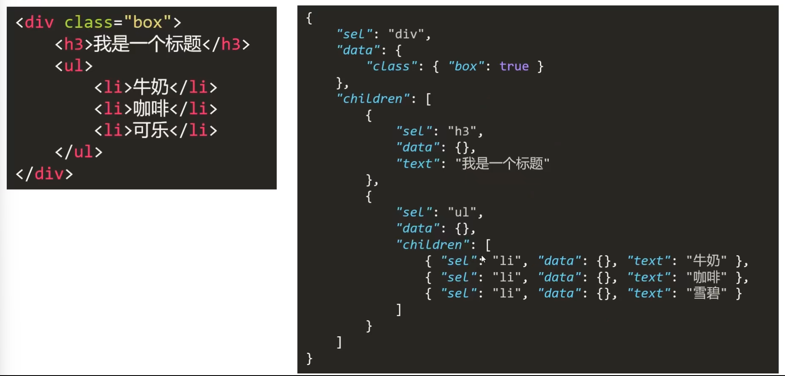
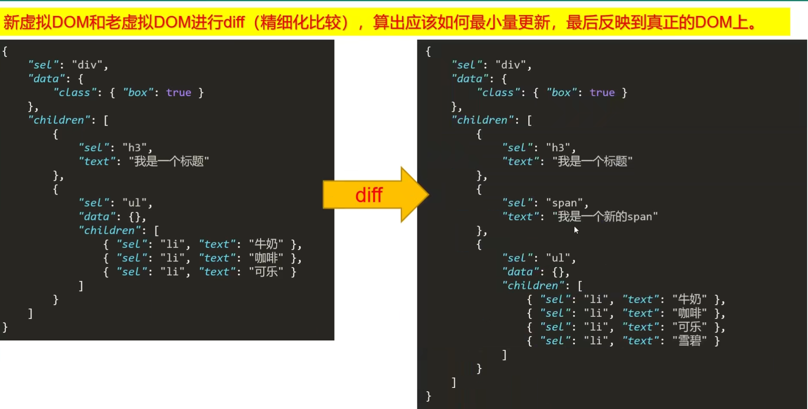
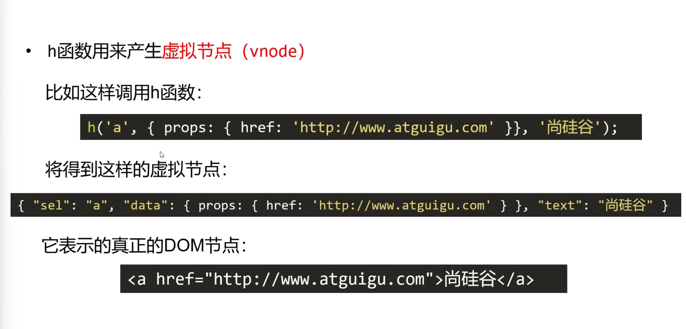
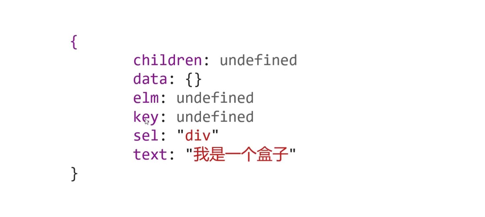
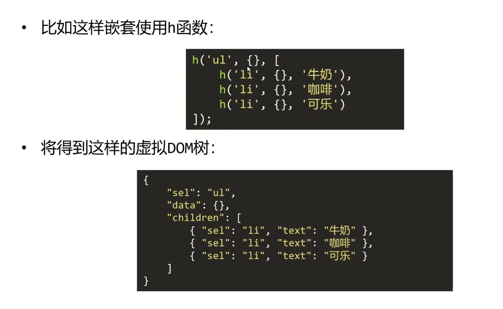

## Diff 算法是什么？

例如一次挪动家具，在我们 Vue 当中，一次渲染则代表一次挪动家具

在程序中，对一个数据的更改如果不通过 diff，就例如将整个家拆掉在重新建，这样效率太低，代价太昂贵。

diff 算法就是程序中进行精细化对比，实现最小量的更新。  

<!-- more -->

## 虚拟 DOM 又是什么？

虚拟节点就是对整个标签内容的描述，以数据化的结构展示，更利于方便操作。

而 diff 更新，就相当于一个新的虚拟 dom 和老的虚拟 dom 进行 diff （精细化比较），算出应该如何最小量更新，最后反映到真实的 dom 当中。

## snabbdom 虚拟 DOM 库

[snabbdom](https://github.com/snabbdom/snabbdom) (瑞典语，“速度”)是著名的虚拟DOM库，是diff算法的鼻祖，Vue源码借鉴了`snabbdom`。

~~~ts
import { classModule, eventListenersModule, h, init, propsModule, styleModule } from 'snabbdom'

const patch = init([
  // Init patch function with chosen modules
  classModule, // makes it easy to toggle classes
  propsModule, // for setting properties on DOM elements
  styleModule, // handles styling on elements with support for animations
  eventListenersModule // attaches event listeners
])

const function_ = () => {}

const container = document.querySelector('#container')

const vnode = h('div#container.two.classes', { on: { click: function_ } }, [
  h('span', { style: { fontWeight: 'bold' } }, 'This is bold'),
  ' and this is just normal text',
  h('a', { props: { href: '/foo' } }, 'I\'ll take you places!')
])
// Patch into empty DOM element – this modifies the DOM as a side effect
patch(container!, vnode)

const newVnode = h('div#container.two.classes', { on: { click: function_ } }, [
  h('span', { style: { fontWeight: 'normal', fontStyle: 'italic' } }, 'This is now italic type'),
  ' and this is still just normal text',
  h('a', { props: { href: '/bar' } }, 'I\'ll take you places!')
])
// Second `patch` invocation
patch(vnode, newVnode) // Snabbdom efficiently updates the old view to the new state
~~~

h 函数用于产生虚拟节点（vnode）

虚拟节点的属性

h 函数可以嵌套使用，从而得到虚拟 DOM 树

~~~ts
import { classModule, eventListenersModule, h, init, propsModule, styleModule } from 'snabbdom'

// 创建出 patch 函数
const patch = init([
  // Init patch function with chosen modules
  classModule, // makes it easy to toggle classes
  propsModule, // for setting properties on DOM elements
  styleModule, // handles styling on elements with support for animations
  eventListenersModule // attaches event listeners
])

// 创建虚拟节点
const vnode1 = h(
  'a',
  {
    props: { href: 'https://www.baidu.com', target: '_blank' }
  },
  '百度一下'
)
const vnode2 = h('div', { class: { box: true } }, '我是一个盒子')
const vnode3 = h('ul', [
  h('li', '苹果'),
  h('li', '西瓜'),
  h('li', [h('div', [h('p', '哈哈'), h('p', '嘻嘻')])]),
  h('li', '火龙果')
])

// 挂在虚拟节点到真实的 DOM 当中
const container = document.querySelector('#container')
patch(container!, vnode3)
~~~